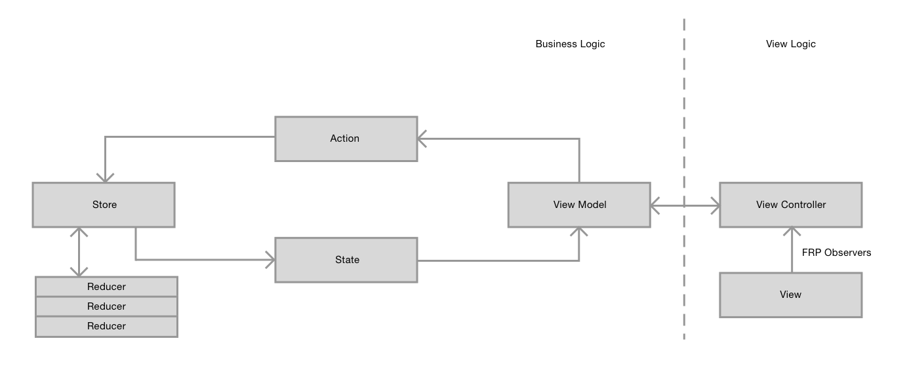
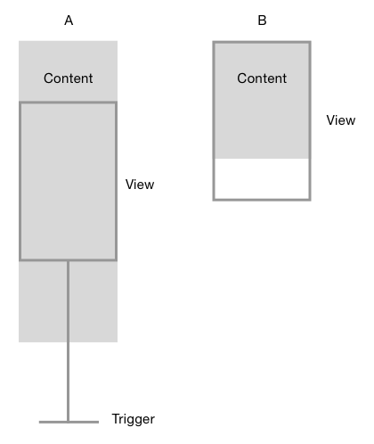

# Infinite Scrolling Message List

Developer: Richard Adem

Email: richy486@gmail.com

Date: October 31, 2017

- [Short Summary of Implementation](#short-summary-of-implementation)
- [Languages and Frameworks](#languages-and-frameworks)
- [Infinite Scrolling](#infinite-scrolling)
- [Fetching Data](#fetching-data)
- [Updating the State](#updating-the-state)
- [Swipe to Dismiss](#swipe-to-dismiss)
- [View Layouts](#view-layouts)
- [Other Dependencies Used](#other-dependencies-used)
- [Debug Menu](#debug-menu)
- [Installing](#installing)
  * [Xcode](#xcode)
  * [Ruby Environment](#ruby-environment)
  * [Bundler](#bundler)
  * [Install the dependencies](#install-the-dependencies)

## Short Summary of Implementation

I have created an app in Swift 4 for iOS 11 that shows an infinite scrolling list of messages that is fetched from a web service.

When the user is close to the bottom of the list or the list of messages doesn't fill the screen another group of messages are fetched from the web service and inserted at the end of the list. Messages can be swiped to the right to remove them from the list.

I wrote this app with the intention of it being ready to extend into a full production app that could be published on the App Store and have used coding patterns that will make extension and modification easier. 

To achieve this extendability I've organized the code into separate areas and for Business logic and View logic, I've use coding patterns such as Unidirectional Data Flow for the business logic and Functional Reactive Programming in the Views to keep that in sync across the different views.

You can find a demo video MessageListDemo.mov in this drive folder as well as the Xcode project 

## Languages and Frameworks

I used Swift 4 because it is the latest version of the language and because it supports new features such as Key Paths for referencing Data model content and the Codable protocol for Serialization.

I used iOS 11 because I wanted to support the latest iOS version for anybody testing the app.

I split up the app into two areas, business logic and view logic with a View Model acting as a bridge between them. This setup creates a structure for the code so we have a clear idea where we should write new code and find code easily we need to change when making modifications to the project. This also reduces the length of the classes and Swift files themselves making the project overall easier to read for the current developer or any possible future developers writing code for this app.

I chose to use a Redux pattern, which is common in the web community and used a lot with the React framework, in an implementation called ReSwift. Redux is used to store and compute the global app state, it is used as a Single-Source-Of-Truth for all global app data and has a Unidirectional-Data-Flow so that everything in the state is updated in sequence and the subscribers always have complete and up to date global state information. The Redux system is responsible for the business side of the app.



I also used a Functional Reactive Programming pattern with the RxSwift and RxCocoa frameworks. I used this because I wanted to keep the views in sync with each other using signals from multiple views combined together when necessary to trigger events. FRP is used on the view logic side only for this app.

## Infinite Scrolling

Infinite scrolling is implemented in MessageListViewController.swift.

I used a regular UITableView hooked up to RxSwift's RxDataSources extension framework because it handles insertion and deletion with it's diffing system that works in O(n) time and the app will be removing cells from the middle of the collection for the Swipe to dismiss actions.

The infinite scroll is achieved by triggering a fetch of new data from two triggers

1. When the user is less than one screen length from the bottom of of the content height

2. If the content height is less than one screen length



I created two new RxCocoa Control Events in ScrollView+NearEdge.swift that can be used with any UIScrollView (such as the UITableView I am using) to check for each of these cases. Since these Control Events are observable in FRP it can be combined in the Message List View Controller to trigger a call to it's View Model function tableDidReachNearEnd() with not much code since they both should trigger the same event.

In the Message List View Model the function tableDidReachNearEnd() sends a signal to it's own triggerFetch PublishSubject which creates a signal but doesn't store a value, it is combined with the signal for isLoading and if a fetch is triggered and the app isn't loading then a message is dispatched to the Redux system to fetch the content.

Using the view height trigger we can be sure that enough messages are loaded into the list 

## Fetching Data

The fetch is dispatched through the Redux system using an Action Creator which can itself dispatch other Redux Actions, in the case when the fetch has completed or if there was an error. The actual web request itself is done with the Swift foundation URLSession using a URLRequest returned from the MessageList data model. The request is created using the Page Token if it was previously and the results are stored in the MessageList data model containing a collection of Message data models that contains a collection of Author data models. The data models are filled using Swift 4's Codable protocol which mostly works out of the box apart from setting the date format\*. The new Message data models are appended to the MessageList's collection and the Page Token is updated. 

All the data models are stored in the Redux state and are updated before any of the Redux store subscribers are updated, that way the entire state is complete when they are updated.

\* Dates default to being shifted to the current hour to simulate recent messages, this can be toggled in the Debug menu accessed from the hamburger menu button.

## Updating the State

View Models are the only subscribers to the store in this app, they act as a bridge between the business side of the app and the view side. They take the state sent from the store and convert it into information that can be used by the View Controllers and the Views they own. The information sent is in the form of objects like Strings or from structs called Presenters. The View Models convert the data so that the Views don't receive any information that they don't need to laying out the view which keeps non view based logic out of the View Controllers helping to prevent Massive View Controller syndrome where View Controllers end up many hundreds or thousands of lines long.

View Controllers subscribe to signals using FRP from the View Model, in the case of Message List View Controller it subscribes to a content Observable which is a computed property that converts the data models into Presenters that can be used by the table view with RxDataSources. It also combines a signal from the Settings state to check if the dates of the messages should be shifted to the current hour (so we can see the messages as if they were created a few minutes ago instead of a few years ago) this setting can be turned off and on in the menu accessed from the hamburger button.

I used a computed function to convert the data instead of regular property because I didn't want to have two copies of similar data in the same object that might go out of sync.

The content is observed by the View Controller and added to the table via RxDataSources and now the app can look for triggers again.

## Swipe to Dismiss

I implemented the Swipe to dismiss with UIGestureRecognizers, I originally planned to use the iOS 11 Table View feature Swipe Actions with tableView(_: leadingSwipeActionsConfigurationForRowAt:), similar to the cell swiping in the iOS Mail app, because it handles the gestures for you. I moved away from that implementation because there is a view associated with the Swipe Action that can't be removed with a that has a non-transparent background and there is a intermediate state half way through the swiping action that leaves the cell partially shifted to one side with an action button where the gap would be. These two issues prevented me from implementing Swipe Actions in the way the design represented the app.

I used UIGestureRecognizers with the RxCocoa extension framework RxGesture in the MessageCell class, this allowed me to add a panning gesture to the MessageCardView as well as add a Publish Subject for the MessageListViewController to observe the dismiss actions on each cell. The Observers are setup in the RxDataSources' configureCell closure each time the content is setup on a cell, this dispose bag of the cell is reset to clear out old observers and the MessageListViewController's reference to self is referenced weakly so the closure doesn't retain the MessageListViewController.

The pan gesture is broken out into protocol SwipePan that could be easily added to other views if we were to extend the app. The gesture is restricted to the X axis only so the user can't move the view up and down. The MessageCardView is translated with Core Graphics' CGAffineTransform which doesn't conflict with the Autolayout we are using to place the MessageCardView and will work with views that are setup with CGRect frames.

When the gesture ends, the user has lifted their finger from the screen, I check if the card view has moved more than half its width to the right, if so then we animate it off fully off screen to the right then call the trigger closure which sends a signal to the dismiss Publish Subject in MessageCell.

If the card view hasn't moved enough to the right it is animated back to it's original position, the transform's identity. The animations have some damping and velocity settings to make the animation look more pleasant.

I also added a check if the Y translation from the gesture, the values coming from the user input and not the translation of the card view, exceed the X translation. If they do I cancel the gesture because the user probably wants to scroll the Table View instead of swiping the cards. When the gesture is canceled the card view animates back to it's original position.

When the card view is dismissed the Table View cell is removed by first observing signals from the cell's dismissed Publish Subject in the RxDataSources' configureCell closure that sends a signal to the cellDismissed with the index path of the cell. The cellDismissed subscriber still in MessageListViewController calls a function on its View Model deleteItem(at:) with the index path. The View Model then translates that index path into a message Id and dispatches an action to the Redux system to delete that message from the store. This is setup so the View Controller has no idea about the message Id or any non-view related data, that way we can switch how the messages are stored on the business side without changing any view code e.g. if we wanted to replace ReSwift with a CoreData backed data store we should need to change the views only the business logic.

The Redux system receives the remove message Action and removes the Message data model from the MessageList collection in the state which triggers the store subscribers to receive a new copy of the state. The MessageListViewModel receives the new state and updates the content for the RxDataSources which uses it's diffing system to remove the single corresponding cell from the Table View without reloading the entire table. The cell animates away by having the lower cells move up over the remaining background of the message cell with the card view animating away off screen to the right giving the effect that the card view has flown off  to the right out of the table.

## View Layouts

The cells can be different heights based on the content string length from the Message data model. The maximum number of lines is 4 based on the design and truncates the end of the string when displaying. For smooth scrolling the heights of the cells are stored in a dictionary keyed with their index path so the table view doesn't jump when inserting cells. 

The jump is caused by the table view not "remembering" the height of cells above it when recalculating the height of the underlying scroll view's content size, reverting back to the default 44pt height causing the table view to scroll up then displaying the visible cells at their correct height based on their constraints after the jump. 

Storing the already viewed cells heights and referencing them in tableView(tableView: estimatedHeightForRowAt:) fixes this jump. If the height hasn't been set in the dictionary yet the cell will use an estimated height of 161pts, this is based on a 4.7" device, using UITableViewAutomaticDimension will still estimate 44pts and cause conflicting constraints in the cells.

Message cells use the Message hash value as an Id for diffing in the RxSwiftDatasources, I used this instead of the message Id because I didn't want to allow the View logic to be able to read the Message data models as this could lead to business logic being written in the Views.

## Other Dependencies Used

I used the SDWebImage framework to cache the author images on the device so they load faster the next time they are referenced.

AFDateHelper is for formatting the date in the style of "X minutes ago" and "X hours ago" etc. 

## Debug Menu

I have utilized the hamburger menu from the designs to show a debug menu, here you can:

* Refresh content, this clears all the messages which triggers a new fetch of content since the table view's content size will be smaller than the view.

* Clear image cache, this calls the clearMemory() and clearDisk() functions on SDWebImage to clear all the author images that are cached if you want to see them load again.

* Use Shifted dates, this option shifts all the dates in the content to the current hour to simulate messages that were posted recently. Currently the dates in the web service content are from 2 years ago.

Future improvements

If this project were to go into production we could further improve it and look at ways to handle larger amounts of data:

* When the new set of messages is fetched the app can immediately fetch another set of messages even though the View Model is preventing extra fetches while loading. This is because RxDataSource performs its cell insertions on the next cycle of the main thread after the data has been returned, since the content size hasn't changed the the new fetch is triggered.

* Prefetching author images using UITableView's UITableViewDataSourcePrefetching protocol. This would be great to have the author images already loaded when we scroll to the cell especially if we have larger images or more variety of image.

* Implement a better navigation system. Currently the app uses closures from a View Model called by the Navigation Controller, this method works for a small app since the navigation implementation is hidden from the View Model/Controller but we might want to integrate the navigation into the global app state which would better represent the entire state of the app. A routing solution that would work well with our ReSwift implementation is ReSwiftRouter.

* We may want to switch from ReSwift to RxState to have a similar interface to the view logic in the business logic side of the app.

* We could observe the velocity of the swiping gesture so the user can "throw" the cards to the right to dismiss them.

## Installing

This app relies on a number of dependencies and uses some tools to keep the same versions of the dependencies on each computer

These are the items we will need:

* Xcode

* rbenv

* bundler

The iOS dependencies are controlled by cocoapods and we use bundler to make sure we are using the same version of cocoapods and rbenv to have a consistent version of ruby to cocoapods with.

### Xcode

We are using Xcode 9.x which includes Swift 4 as well as Xcode tools.

### Ruby Environment

Ruby Environment can be installed using Brew:

```shell
brew update
brew install rbenv
rbenv init
```

### Bundler

Install bundler with the command:

```shell
[sudo] gem install bundler
```

### Install the dependencies

Install cocoapods with:

```shell
bundle install
```

Then install the cocoapods frameworks (pods):

```shell
bundle exec pod install
```
Open the project using the workspace file MessageList.xcworkspace the you should be able to compile and run the app.

